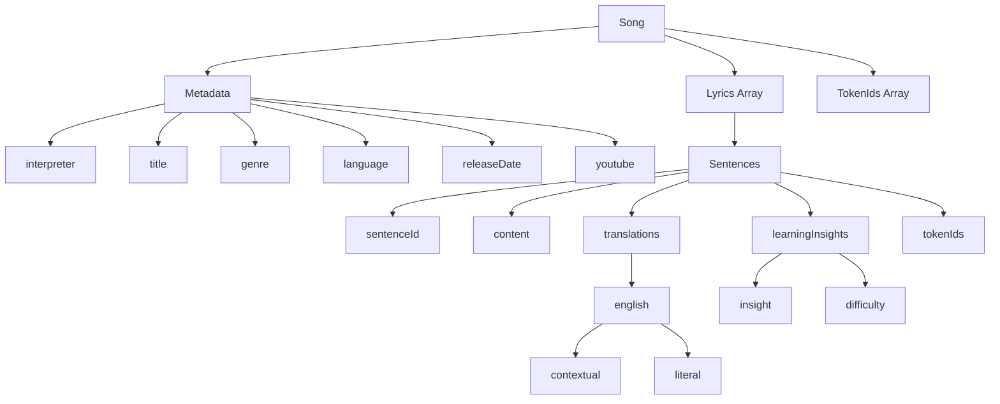
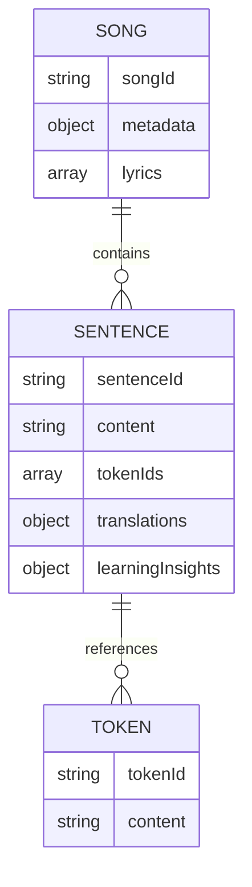

# System Patterns

## Data Structure

## Data Organization

The application uses three main JSON files for data storage:

1. `text-entries.json`:

   - Contains song metadata
   - Maps song IDs to lyrics (sentence IDs)
   - Stores creation/update timestamps

2. `sentences.json`:

   - Stores individual sentences with:
     - Unique sentence IDs
     - Original content
     - Token mappings
     - Translations (contextual and literal)
     - Learning insights
     - Grammatical difficulty levels

3. `tokens.json`:
   - Contains individual word/token data
   - Referenced by sentences through tokenIds

## Data Relationships

## Key Features

1. **Modular Content Structure**:

   - Each sentence is independently stored and reusable
   - Tokens are atomized for granular language analysis

2. **Rich Metadata**:

   - Song information includes genre, language, release date
   - Learning insights provide pedagogical context
   - Translations offer both literal and contextual understanding

3. **Hierarchical Organization**:

   - Songs contain sentences
   - Sentences contain tokens
   - Each level maintains its own metadata and relationships

4. **Language Learning Focus**:
   - Difficulty ratings for grammatical concepts
   - Detailed linguistic insights
   - Multiple translation layers
